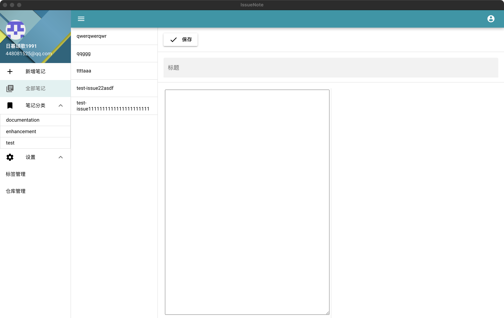

### IssueNote

IssueNote 是基于 quasar 构建，将个人笔记存储于 issue 里的多端应用

- gitee: https://gitee.com/QWganker/issuenote
- github https://github.com/qwganker/issuenote

### 预览



### 开发手册

1. 安装依赖

```bash
npm install
```

2. 本地运行

```bash
quasar dev
```

3. 打包 electron 应用

```
quasar build -m electron
```
